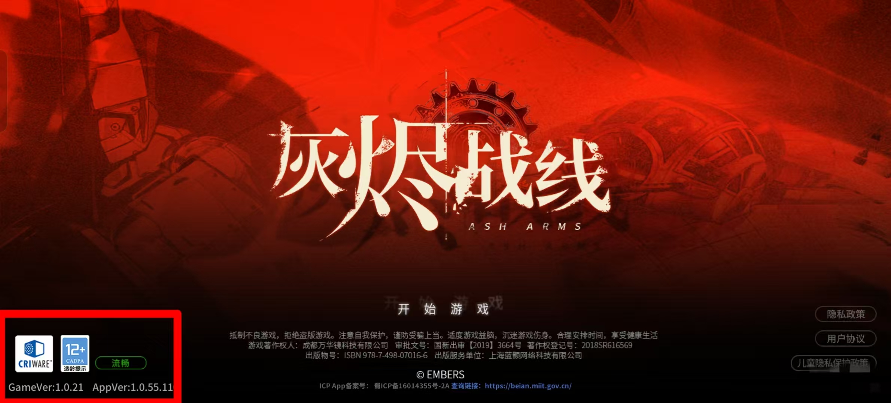

# Asharms-data-tools

灰烬战线国服(B服)数据下载解密工具

## 环境安装

推荐在虚拟环境中安装依赖

```shell
pip install -r ./requirements.txt
```

## 使用方法

### 项目配置

配置文件位于 `settings.projectEnv.py`中

+ `projectPath`为项目目录,**请勿更改**
+ `cachePath`为缓存目录,可自定义更改
+ `outPath`为解密文件导出目录,可自定义更改

### 游戏相关配置

配置文件位于 `settings.gameEnv.py`中

+ `version`游戏版本,[查看方法](#查看GameVersion)

### 运行文件

运行 `main.py`,即可对数据进行更新下载

## 查看GameVersion

进到游戏主界面(如下图),左下角的GameVer的值即为游戏版本,如截图显示为 `1.0.21`


